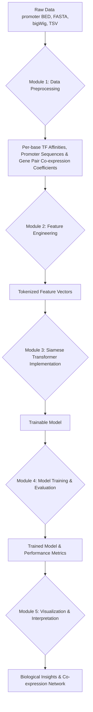

# Implementation Plan: Predicting Gene Co-expression in *Arabidopsis thaliana*

## 1. Project Vision and Goals

This document outlines the implementation plan for developing a machine learning model to predict gene co-expression in *Arabidopsis thaliana*. The project is based on the detailed research plan and is designed to be executed by a team of software engineers.

The primary goal is to build a Siamese transformer model that learns a "TF vocabulary" from DAP-seq data to predict co-expression between gene pairs. This will provide novel insights into gene regulatory networks.

## 2. High-Level Architecture

The project is divided into five distinct modules that form a sequential data processing and modeling pipeline. Each module has a clear set of responsibilities and deliverables, allowing for parallel development and clear ownership.

### Project Workflow

The overall workflow is as follows:

## 3. Module Breakdown and Responsibilities

### Module 1: Data Curation and Preprocessing
- **Lead Engineer:** TBD
- **Objective:** To process the raw genomic, transcriptomic, and co-expression data into a clean, structured format suitable for per-base feature generation in Module 2.
- **Key Responsibilities:**
    - Ingest and parse all raw data files (promoter BED, FASTA, bigWig, TSV).
    - Process promoter regions using the provided promoter BED file and extract corresponding DNA sequences from FASTA.
    - Extract and normalize TF binding signals (e.g., from bigWig files) per base within the defined promoter regions.
    - Prepare the dataset of gene pairs with co-expression correlation coefficients (provided TSV).
- **Deliverable:** A set of curated data files containing: per-base normalized TF binding signals for promoter regions, the corresponding promoter DNA sequences, and a dataset of gene pairs with their associated co-expression correlation coefficients.

### Module 2: Feature Engineering
- **Lead Engineer:** TBD
- **Objective:** To implement the feature engineering process, creating tokenized feature vectors for each gene's promoter region.
- **Key Responsibilities:**
    - Develop a pipeline to generate tokenized feature vectors using a sliding window, aggregation, and clustering approach.
    - Concatenate one-hot encoded DNA with TF binding signals.
    - Apply a sliding window to the concatenated data, aggregate features within each window, and cluster the results to create a final tokenized vector.
- **Deliverable:** A dataset where each gene's promoter is represented as a 1D tokenized vector.

### Module 3: Siamese Transformer Model Implementation
- **Lead Engineer:** TBD
- **Objective:** To build the Siamese transformer model in PyTorch.
- **Key Responsibilities:**
    - Implement the Siamese architecture with weight-sharing transformer encoders.
    - Implement a layer to project heterogeneous input token vector into a single, unified, homogeneous embedding space that the Transformer can understand.
    - Build the core transformer encoder blocks (self-attention, feed-forward networks).
    - Implement the regression head for predicting co-expression.
- **Deliverable:** A well-structured, documented, and trainable model script.

### Module 4: Model Training and Evaluation
- **Lead Engineer:** TBD
- **Objective:** To train, tune, and rigorously evaluate the model's performance.
- **Key Responsibilities:**
    - Develop the complete training, validation, and testing pipeline.
    - Implement data loaders and a gene-disjoint data splitting strategy.
    - Manage hyperparameter tuning experiments.
    - Track and report key performance metrics (train/validation loss, loss type is regression against gene co-expression correlation coefficient).
    - Implement early stopping to prevent overfitting.
    - Test the model on the testing dataset, collect metrics (Regression loss, etc.)
- **Deliverable:** A trained model, performance metrics, and a report on the results of the training experiments.

### Module 5: Visualization and Interpretation
- **Lead Engineer:** TBD
- **Objective:** To create tools for visualizing model performance and interpreting its predictions to derive biological insights.
- **Key Responsibilities:**
    - Develop scripts to plot performance curves (e.g., training/validation loss over epochs) and diagnostic plots relevant to regression (e.g., scatter plots of predicted vs. actual co-expression coefficients, residual plots).
    - Implement methods to extract and visualize attention maps from the transformer model to understand feature importance.
    - Generate and visualize a predicted gene co-expression network based on model outputs.
- **Deliverable:** A suite of visualization scripts and a final report detailing interpreted results, model understanding, and biological insights.

## 4. Collaboration and Version Control

All code will be managed using Git. Engineers are expected to work in separate feature branches for their respective modules and submit pull requests for review. This will ensure code quality and a smooth integration process. Regular team meetings will be held to discuss progress, challenges, and ensure alignment across modules.